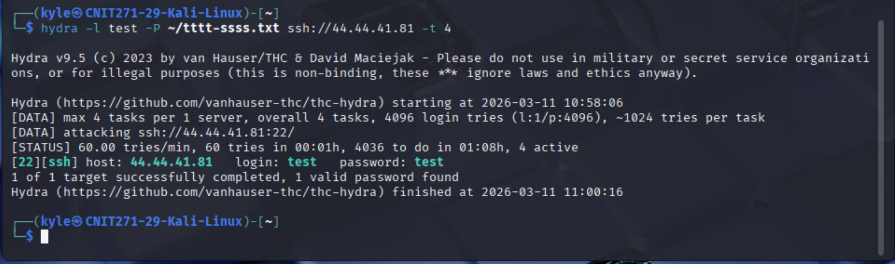

#  AWS IoT Device Security & Cloud Attack Simulation

## Executive Summary
This project is an end-to-end demonstration of the IoT security lifecycle, encompassing both **Defensive Cloud Architecture** and **Offensive Threat Simulation**. 

The system establishes a highly secure, cryptographic communication pipeline between a physical Raspberry Pi and AWS IoT Core using X.509 certificates and TLS-encrypted MQTT telemetry. To demonstrate the dichotomy of IoT security, the project then pivots to an offensive posture, executing a targeted SSH dictionary attack to prove that even enterprise-grade cloud authentication cannot mitigate the risks of weak local edge-device credentials.

##  Tech Stack
* **Cloud Infrastructure:** AWS IoT Core, AWS IoT Device Management
* **Authentication & Cryptography:** X.509 Certificates, Public Key Infrastructure (PKI), TLS Encryption
* **Protocols:** MQTT5, SSH
* **Hardware/OS:** Raspberry Pi, Ubuntu 24.04 LTS, Kali Linux
* **Offensive Tools:** Hydra (Brute-force/Dictionary attacks), Crunch (Wordlist generation)

---

##  System Architecture & Threat Model

The architecture models a real-world edge-to-cloud deployment alongside an active internal threat vector.

  
   
  <b>Figure 1: Secure Cloud Telemetry Pipeline vs. Local Attack Path</b>

### The Dual-Path Paradigm:
* **The Secure Path (Blue):** The Raspberry Pi utilizes the AWS IoT Python SDK and X.509 certificates to establish a mutually authenticated, encrypted TLS tunnel to AWS IoT Core for telemetry publishing.
* **The Vulnerable Path (Red):** An attacker on the local network (Kali Linux) bypasses the cloud entirely, targeting the edge device's local SSH service via dictionary attacks.

---

##  Phase 1: Defensive IoT Provisioning & Cloud Architecture

### 1. Device Identity & Registry
The physical device is digitally represented by creating an IoT "Thing" within the AWS registry. The device is configured with a classic Unnamed Shadow, allowing AWS to maintain a JSON-based state representation even during device disconnects.

  

### 2. Cryptographic Authentication (PKI)
Passwords are not used for cloud authentication. Instead, AWS automatically generates a robust cryptographic identity consisting of an X.509 device certificate, a public/private key pair, and Root CA certificates. This ensures zero-trust mutual authentication between the edge device and the AWS broker.

  

### 3. Secure MQTT Telemetry Execution
The Raspberry Pi is provisioned with the connection kit. Executing the initialization script (`./start.sh`) connects the device to the AWS IoT endpoint using the `basicPubSub` client ID and begins securely publishing telemetry to the `sdk/test/python` topic. 

  

### 4. Cloud Verification
The AWS IoT MQTT test client successfully subscribes to the topic (e.g., `Home1/Room1/Lightbulb`) to verify uninterrupted, decrypted message delivery in the cloud. 

  

Live telemetry streaming is then confirmed in real-time within the AWS console, proving the end-to-end pipeline is fully operational.

  

---

##  Phase 2: Offensive Security & Threat Simulation

To demonstrate the "weakest link" principle in enterprise IoT deployments, the project pivots to an offensive engagement against the physical hardware.

### 1. Automated Dictionary Attack (Hydra)
Using a custom wordlist generated via Crunch, the Kali Linux attacker machine targets the Raspberry Pi's SSH service (Port 22). Using **Hydra**, the system executes a high-speed parallel dictionary attack against the target IP. 
* **Result:** Hydra successfully cracks the authentication in under two minutes, identifying the weak local credentials (`test:test`).

  

### 2. Device Compromise
With the credentials acquired, the attacker establishes an interactive SSH session into the Ubuntu 24.04 LTS environment on the Raspberry Pi. The edge device is now completely compromised, granting the attacker potential lateral movement capabilities or the ability to exfiltrate the AWS X.509 certificates.

  

---

##  Strategic Impact & Security Outcomes

* **The Edge-to-Cloud Vulnerability Gap:** Proved that enterprise-grade cloud security (TLS/X.509) is completely neutralized if local edge-device security (SSH/default passwords) is poorly governed.
* **Identity Over Passwords:** Successfully implemented a highly scalable, password-less PKI authentication model for IoT devices, eliminating credential-stuffing attacks on the cloud broker.
* **Resilient Operations:** Diagnosed and resolved MQTT connection hangups caused by stale certificate kits, reinforcing the operational necessity of strict certificate lifecycle management and accurate endpoint routing.
